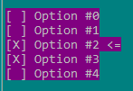

# FinalShitot

C++ final project
## Getting Started

Run the program in Visual Studio

## Authors

* **Alan Trope** - *337637961*
* **Amit Shwartz** - *305432775*
* **Dolev Farhi** - *311142657*
* **Fabian Roitman** - *337912844*

## Components

**Panel**

**Label**

**Button**

**Text Box**

**Message Box**

**Numeric Box**

**Check List**

**Radio Box**

